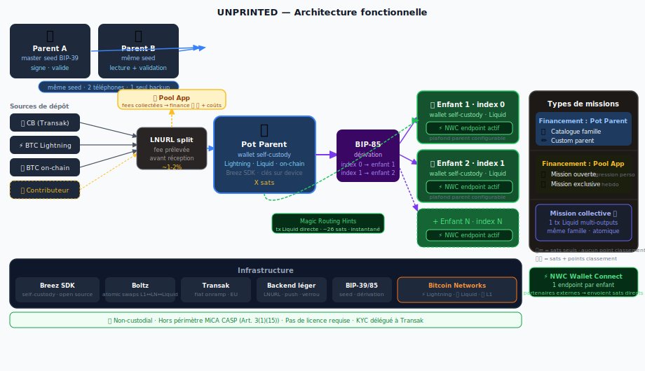
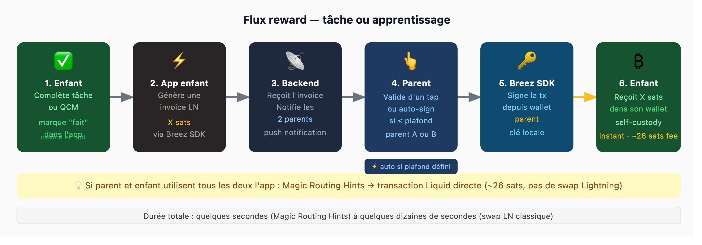
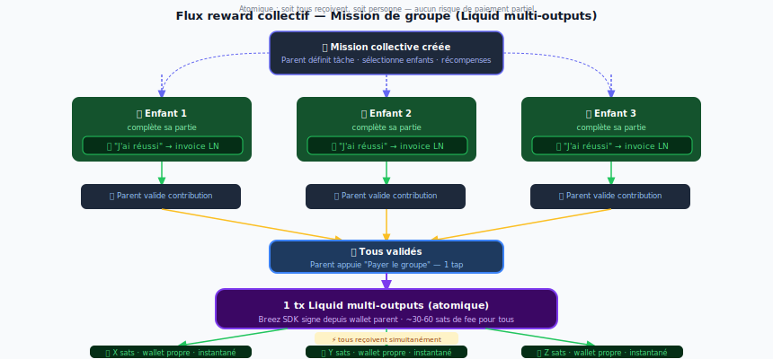

# Architecture

Orange Peel is built around one principle: **the app never holds funds**. Every sat lives in a self-custody wallet controlled by a family member.

***

## Wallet structure

```
Parent A (master BIP-39 seed)     Parent B
  family pot: X sats               same seed · read + validate

              ↓ BIP-85 derivation

  Child 1         Child 2         Child N
  index 0         index 1         index N
  self-custody    self-custody    self-custody
```

One BIP-39 seed → unlimited child wallets via BIP-85 derivation. One backup for the whole family. Each child's wallet is fully self-custodied — derived on-device, keys never leave the phone.

Two parents can share the same seed on two phones. A backend payment lock ensures a Lightning invoice is only signed once — no double payment possible.

***

## Full architecture diagram



***

## Reward Flow

End-to-end child reward: invoice → validation → payout.



→ [Full details](reward-flow.md)

***

## Collective Rewards

Multi-child collaborative missions — one parent transaction, multiple child wallets paid atomically via Liquid multi-outputs.



→ [Full details](collective-flow.md)
