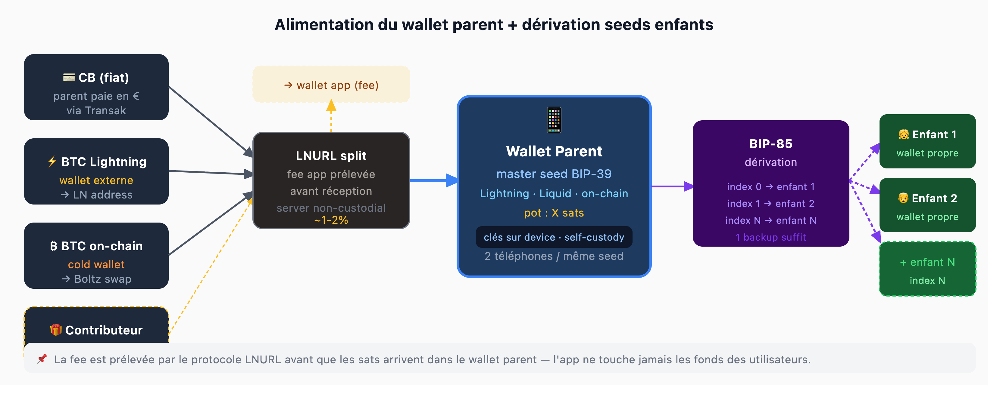

# BIP-85 Funding Flow

How a parent deposit flows from fiat (or Lightning) into the family pot — with the fee extracted at protocol level before any sat touches the wallet.

***

## The flow

1. Parent deposits via **Transak** (card → sats), direct Lightning/on-chain, or a third party (grandparents, relatives) sending directly to the parent's Lightning address
2. Funds route through the **LNURL-pay server** — our fee (1–2%) is split _before_ sats arrive
3. Sats land in the **parent wallet** (Breez SDK, self-custody)
4. From the parent pot, rewards are paid out to child wallets via Lightning or Liquid

The fee is never held by the backend. It is extracted by the protocol. This is what keeps us non-custodial and MiCA-exempt.

***

## Diagram



***

## BIP-85 derivation

The parent's BIP-39 master seed derives child wallets deterministically:

```
master seed (BIP-39)
  └─ BIP-85 path m/83696968'/0'/0'  → child 1 seed
  └─ BIP-85 path m/83696968'/0'/1'  → child 2 seed
  └─ BIP-85 path m/83696968'/0'/N'  → child N seed
```

Derivation happens on-device. One family backup covers every wallet.
