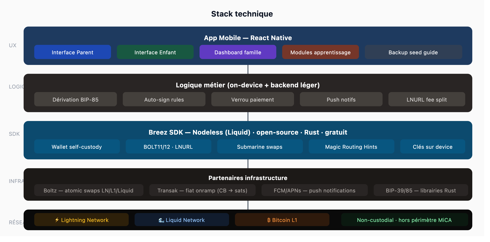

# Tech Stack

These are starting assumptions, not mandates — open to better ideas from the team.

---

## Diagram

---

## Layer by layer

| Layer | Choice | Why |
|---|---|---|
| Mobile | React Native | iOS + Android from one codebase |
| Bitcoin / wallet | Breez SDK Nodeless | Self-custody, Lightning + Liquid + NWC, open-source |
| Seed architecture | BIP-39 + BIP-85 | 1 parent seed → N child wallets, 1 family backup |
| Fee split | LNURL-pay | Fee taken at protocol level before funds hit the wallet |
| Swaps | Boltz | LN ↔ L1 ↔ Liquid atomic swaps |
| Fiat onramp | Transak | Card → sats, KYC delegated, revenue share |
| Push | FCM / APNs | Parent validation notifications |
| Backend | Lightweight (Node or Python) | LNURL server, payment lock, push relay |

---

## Why Breez SDK Nodeless

Breez SDK handles the hardest parts of the wallet layer out of the box:

- Full Lightning + Liquid + on-chain support
- NWC (Nostr Wallet Connect) endpoint exposed natively per wallet
- Rust/FFI core with React Native bindings
- Open-source, non-custodial

The team should not need to build wallet infrastructure from scratch.

## Why LNURL fee split

The fee must be extracted *before* sats reach the parent wallet. If the app held funds even briefly, it would be custodial — triggering MiCA CASP obligations (Article 3(1)(15)).

LNURL-pay with a fee split parameter solves this at the protocol level. The backend is never a custodian; it's a routing layer.
